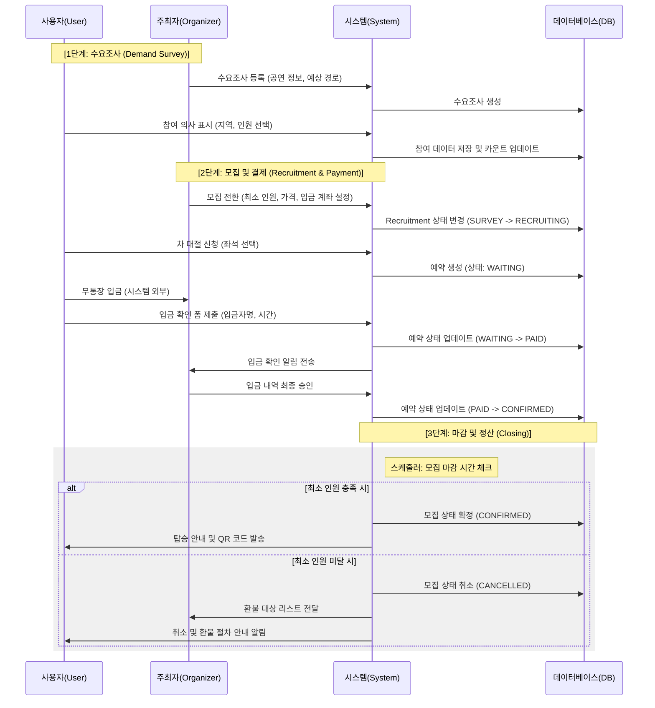

# Allreva 프로젝트 요구사항 분석 및 도메인 정리

## 1. 요구사항 명세 수정 및 보완 가이드

한국 SI 기업 취업을 목표로 한다면, 단순 기능 리스트를 넘어 **비즈니스 규칙(Business Rule)**과 **예외 상황(Edge Case)**에 대한 정의를 보완해야 합니다.

### 💡 주요 보완 포인트
*   **차 대절(Bus Rental) 프로세스 구체화**
    *   단순 '입금 확인 폼'을 넘어 입금 확인 주체, 상태값 변화(대기->완료->확정), 환불 정책 정의 필요.
    *   최소 인원 미달 시 자동 취소 또는 추가금 발생 로직 명시.
*   **외부 데이터(KOPIS API) 연동 정책**
    *   실시간 호출 vs 스케줄러를 통한 DB 캐싱 전략 명시.
    *   동기화 주기 및 실패 시 대응 방안.
*   **데이터 무결성 및 유효성 검사**
    *   좌석 리뷰 중복 방지 로직 (동일 공연/좌석에 대한 1인 1리뷰 등).
    *   실제 관람 인증 프로세스 검토.
*   **시스템 제약 사항 (비기능 요구사항)**
    *   채팅 메시지 보관 기간 및 참여 인원 제한.
    *   파일/이미지 전송 시 용량 제한 및 보안 검사.
*   **권한 관리(ACL)**
    *   비회원, 일반회원, 주최자, 관리자별 상세 접근 권한 매트릭스 작성.

---

## 2. 프로젝트 주요 도메인 구성

요구사항과 설계를 바탕으로 도출된 7개 핵심 도메인입니다.

1.  **Member (회원):** 계정 관리, 인증/인가, 프로필, 마이페이지.
2.  **Concert (공연):** 공연 상세 정보, 외부 API 연동 데이터 관리.
3.  **Place (공연장):** 위치 정보, 시설 안내, 좌석 레이아웃.
4.  **Review (리뷰):** 좌석별 시야 후기, 평점, 좋아요(공감) 시스템.
5.  **Recruitment (모집):** 차 대절 수요 조사, 버스 예약, 덕질 메이트 구인.
6.  **Chat (채팅):** 실시간 메시징(Socket), 채팅방 관리, 메시지 이력.
7.  **Notification (알림):** 상태 변경 알림, 일정 리마인더, 실시간 푸시.

---

## 3. SI 면접용 기술적 제언
*   **데이터 정합성:** 분산 환경(채팅 등)에서의 데이터 일치성 보장 전략 준비.
*   **트랜잭션 관리:** 입금 및 예약 프로세스에서의 원자성 보장 방식 강조.
*   **표준화:** REST API 컨벤션 및 공통 에러 처리 구조를 통한 협업 효율성 어필.

