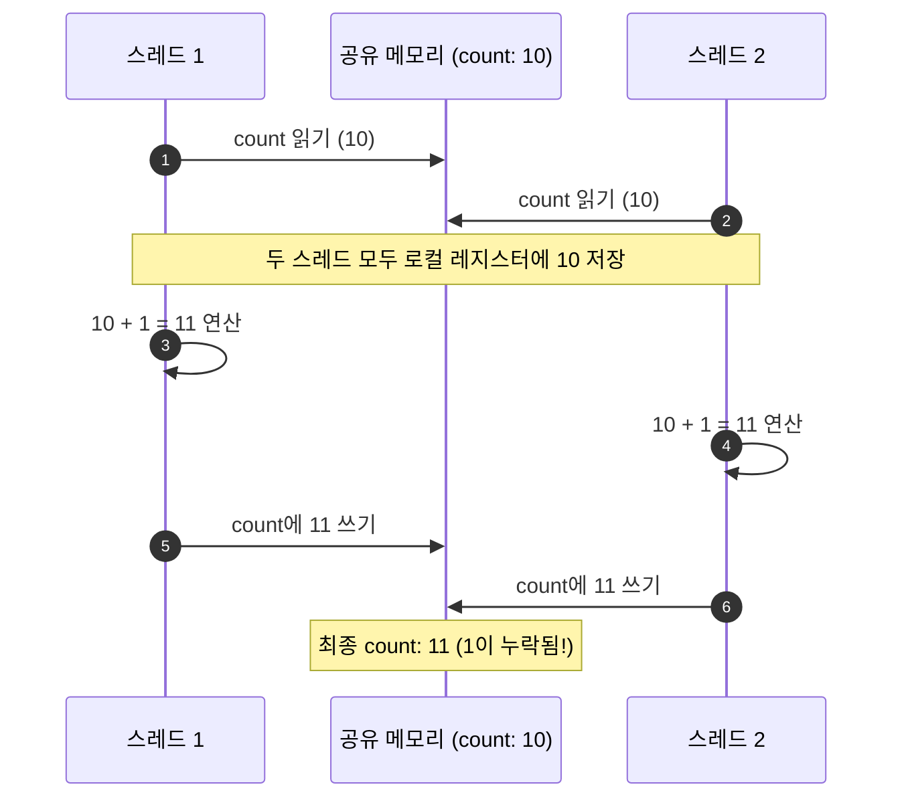
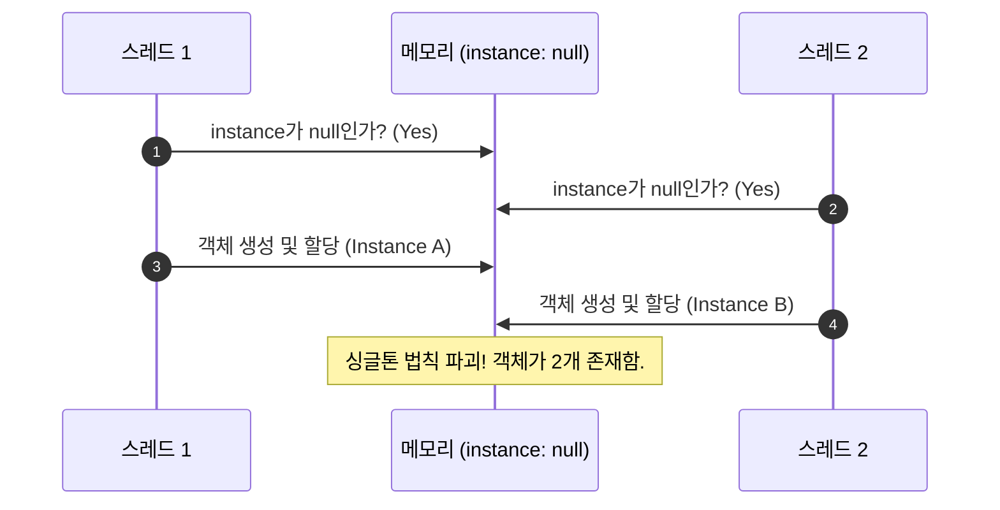
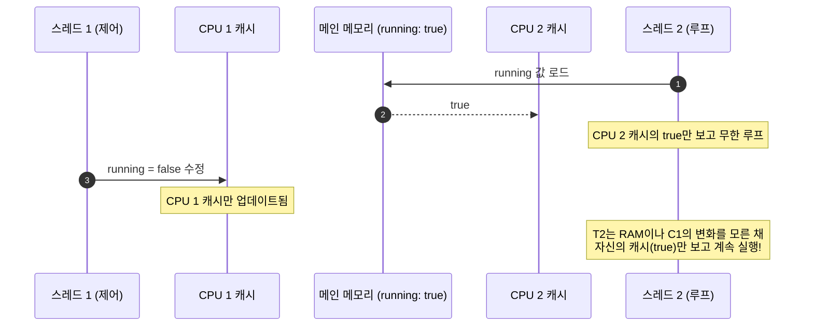
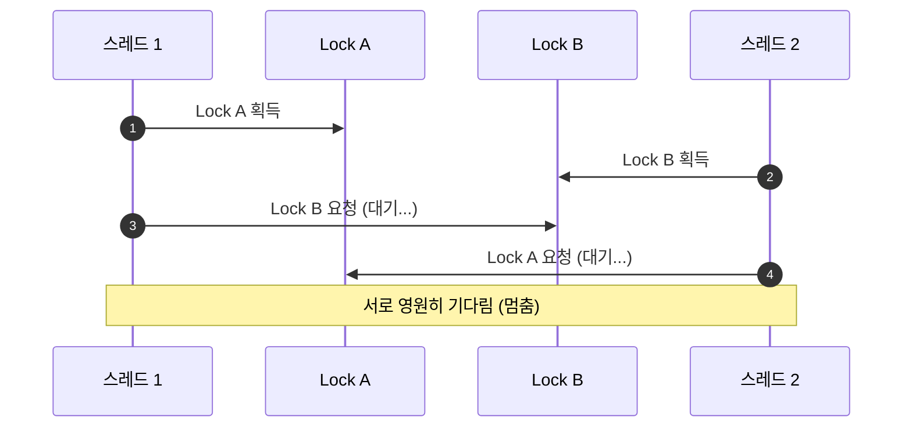
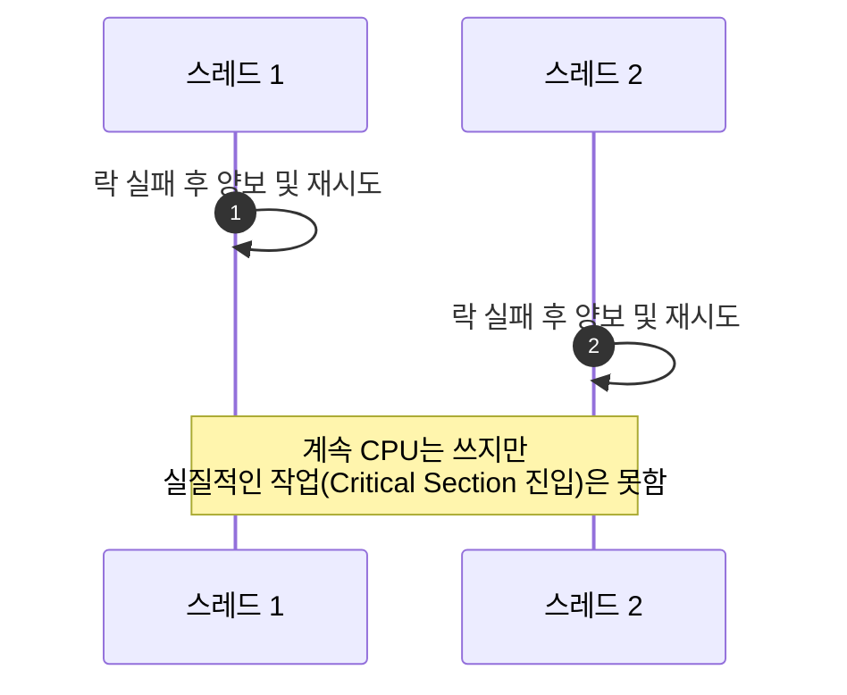

락# 정리: 애플리케이션 동시성 이상 현상 (OS/Runtime Level) 정복

애플리케이션 단의 동시성 문제는 주로 **메모리 공유**, **CPU 캐시**, **스케줄링**에 의해 발생합니다.

---

## 1. Race Condition: Read-Modify-Write (RMW)
- **상황**: 공유 변수를 읽고(`R`), 수정하고(`M`), 쓰는(`W`) 과정이 원자적이지 않음.
- **실무 예시**: 여러 스레드가 동시에 `count++`를 수행하여 카운트가 누락되는 경우.

---

## 2. Race Condition: Check-then-Act (CTA)
- **상황**: 조건 확인(`Check`)과 행동(`Act`) 사이에 상태가 변함.
- **실무 예시**: 싱글톤 객체 생성 시, `if (instance == null)` 체크 직후 다른 스레드가 먼저 생성해버려 객체가 2개 생기는 경우.

---

## 3. Visibility Issue (가시성 문제)
- **상황**: 한 스레드가 변경한 값이 CPU 캐시에만 머물러 다른 스레드에게 보이지 않음.
- **실무 예시**: '중지 플래그'(`running = false`)를 세팅했는데, 루프를 도는 스레드가 이 값을 못 보고 무한 루프에 빠지는 경우.

---

## 4. Deadlock (교착 상태)
- **상황**: 두 개 이상의 스레드가 서로가 가진 자원을 무한히 기다림.
- **실무 예시**: 스레드 1이 락 A를 잡고 B를 기다리는데, 스레드 2가 락 B를 잡고 A를 기다리는 경우.

---

## 5. Livelock (활성 교착)
- **상황**: 상태는 계속 변하지만 진행이 안 됨.
- **실무 예시**: 좁은 복도에서 마주친 두 사람이 서로 양보하려고 왼쪽, 오른쪽으로 동시에 움직여서 계속 길을 막는 경우.

---

## 6. Starvation (기아 상태)
- **상황**: 특정 스레드가 우선순위에서 밀려 자원을 영원히 할당받지 못함.
- **실무 예시**: 높은 우선순위의 작업이 계속 들어와서, 낮은 우선순위의 로그 수집 스레드가 한 번도 실행되지 못하는 경우.
