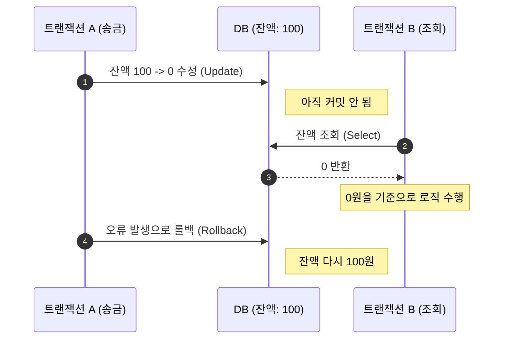
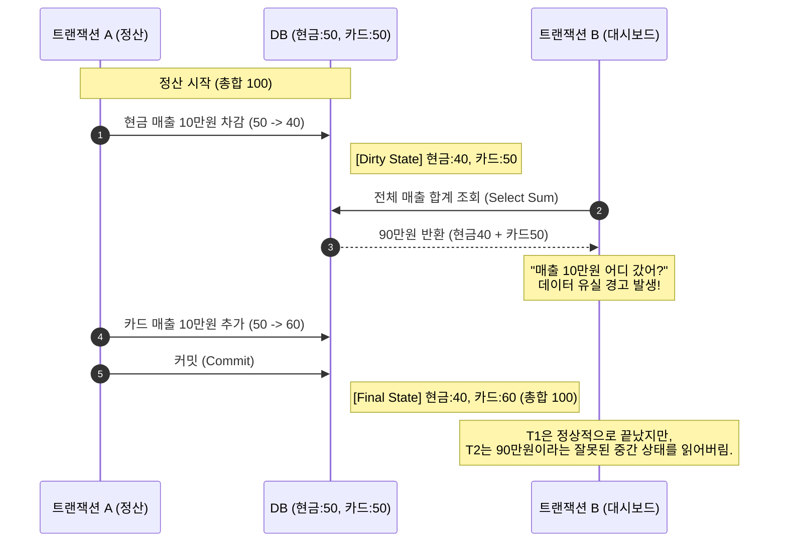
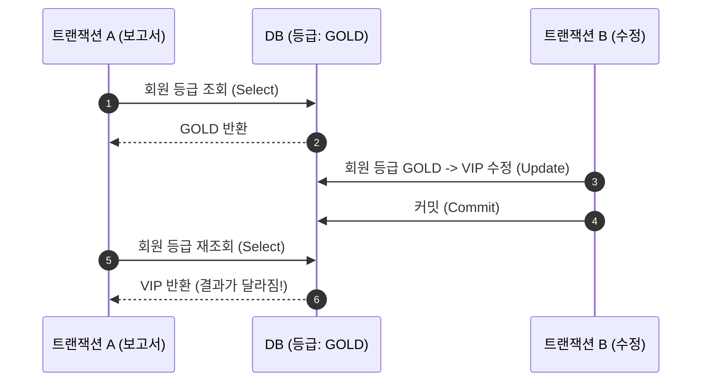
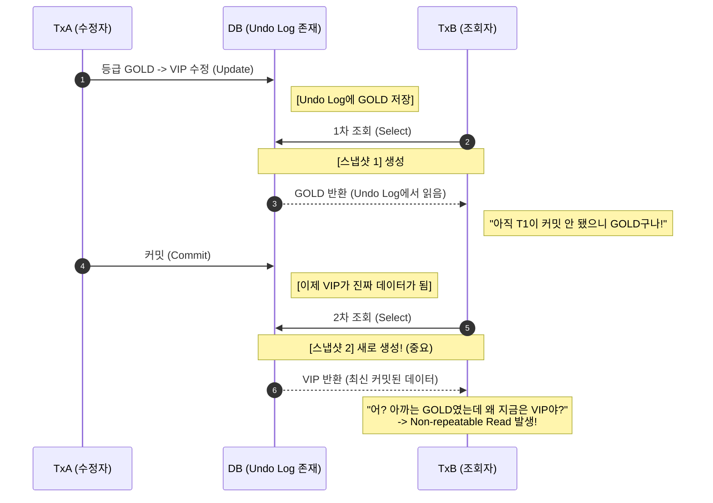
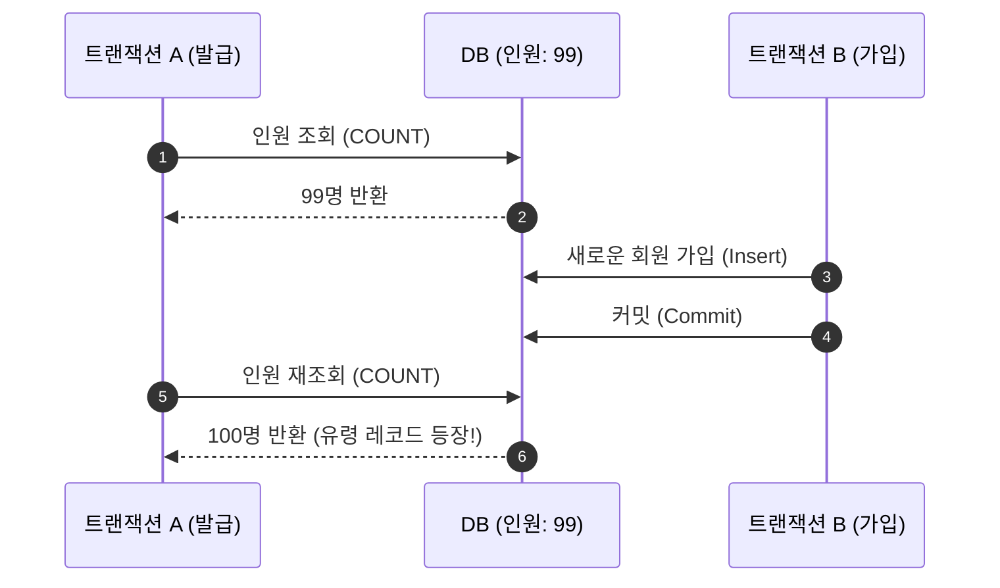
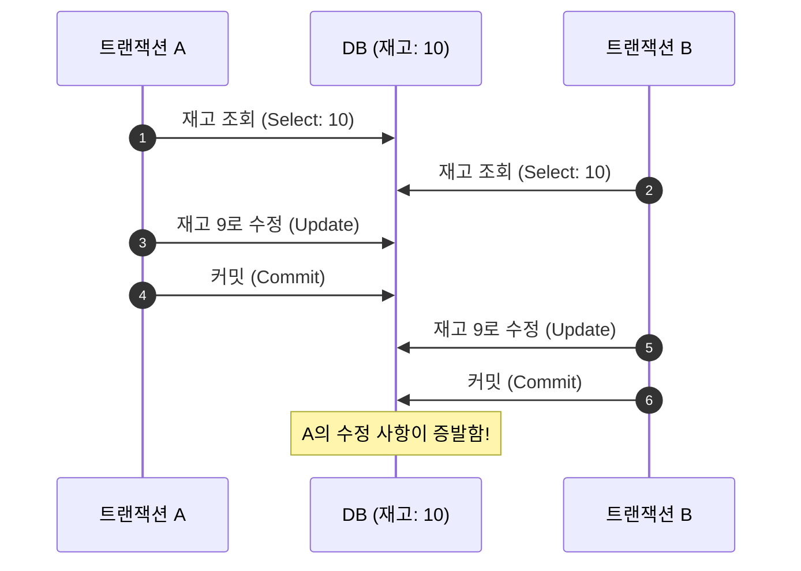
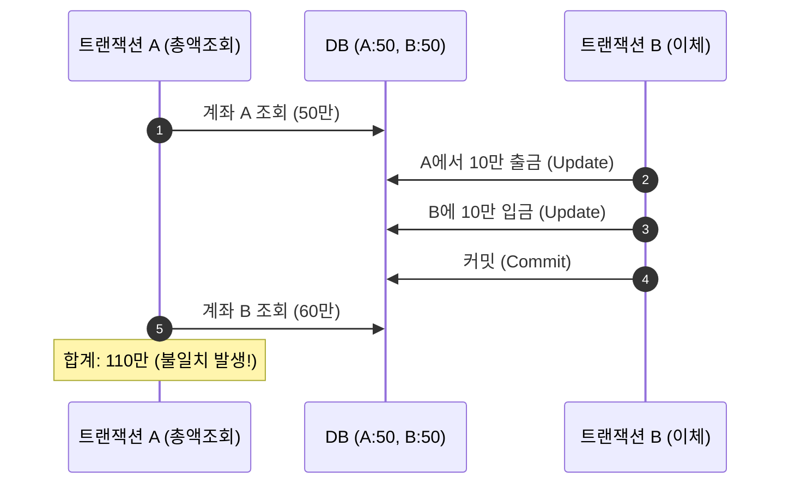
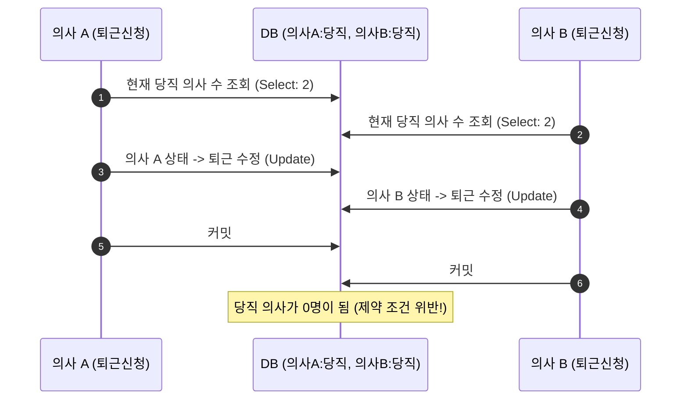
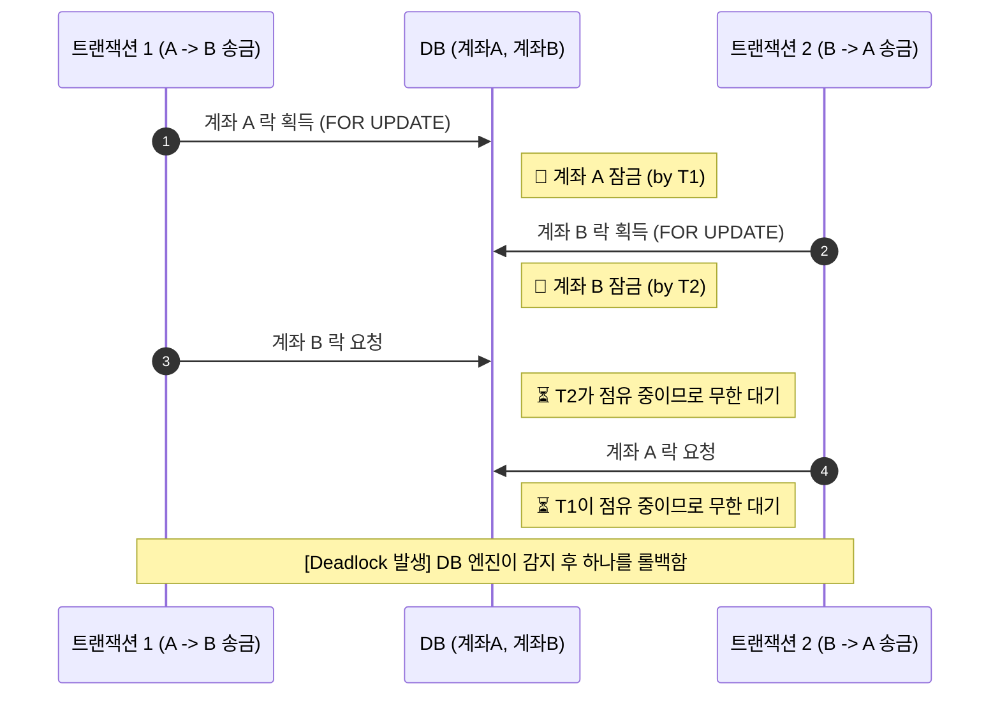

# 정리: DB 동시성 이상 현상 (Concurrency Anomalies) 정복

이 문서는 DB 트랜잭션 격리 수준에 따라 발생할 수 있는 이상 현상들을 실무 예시와 시퀀스 다이어그램으로 정리합니다.

---

## 1. Dirty Read (오염된 읽기)
- **상황**: 트랜잭션 A가 커밋하지 않은 데이터를 B가 읽음.
- **실무 예시**: 송금 처리 중 '일시적인 잔액 0원' 상태를 다른 트랜잭션이 조회하여 '대출 거절' 판정을 내리는 경우.

### 🏢 실무 예시: 야간 정산 프로세스
- **제약 조건**: 총 매출 = 현금 매출 + 카드 매출이 항상 맞아야 함.
- **트랜잭션 A (정산)**: 현금 매출 100만 원을 카드 매출로 잘못 기록된 걸 바로잡는 중 (현금 -10, 카드 +10).
- **트랜잭션 B (조회)**: 경영진이 실시간 대시보드로 현재 총 매출을 조회.

---

## 2. Non-repeatable Read (반복 불가능한 읽기)
- **상황**: 한 트랜잭션 내에서 같은 조회를 두 번 했는데 결과가 다름 (수정 때문).
- **실무 예시**: 정산 보고서 작성 중, 다른 사용자가 회원 등급을 수정하여 보고서 상단과 하단의 회원 정보가 불일치하는 경우.

### 📊 MVCC 동작 예시 (Read Committed 환경)

---

## 3. Phantom Read (유령 읽기)
- **상황**: 범위 조회를 두 번 했는데, 결과 집합에 없던 레코드가 나타남 (삽입 때문).
- **실무 예시**: 선착순 100명 쿠폰 발급 전 인원 체크를 했는데, 그 사이 다른 사람이 가입하여 실제로는 100명이 넘게 발급되는 경우.

---

## 4. Lost Update (갱신 손실)
- **상황**: 두 트랜잭션이 동시에 수정할 때, 나중 커밋이 먼저 커밋을 덮어씀.
- **실무 예시**: 두 명의 운영자가 동시에 같은 상품의 재고를 수정(10->9)했는데, 결과적으로 8이 아닌 9가 되는 경우.

---

## 5. Read Skew (읽기 왜곡)
- **상황**: 한 트랜잭션이 여러 데이터를 읽을 때, 그 사이 다른 트랜잭션이 데이터를 옮겨버려 합계가 안 맞음.
- **실무 예시**: 계좌 A(50만)에서 계좌 B(50만)로 10만을 이체하는 중, 총액(100만)을 조회했더니 90만이나 110만으로 조회되는 경우.

---

## 6. Write Skew (쓰기 왜곡)
- **상황**: 서로 다른 데이터를 수정했는데, 결과적으로 비즈니스 제약 조건이 깨짐.
- **실무 예시**: "최소 1명의 의사는 당직이어야 한다"는 규칙이 있는데, 두 의사가 동시에 서로가 있는 줄 알고 각자 퇴근을 승인해버려 당직이 0명이 되는 경우.

---

## 7. Deadlock (교착 상태)
- **상황**: 두 개 이상의 트랜잭션이 서로가 가진 락을 얻으려고 무한히 대기하는 상태.
- **실무 예시**: 사용자 A와 B가 서로에게 동시에 돈을 송금할 때, 각자의 계좌에 락을 건 뒤 상대방의 계좌 락을 요청하며 멈추는 경우.

