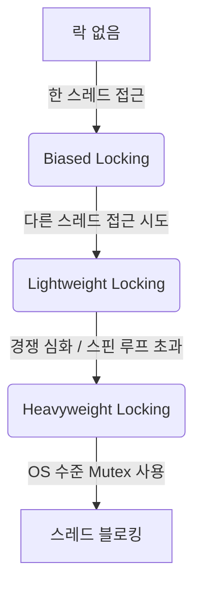
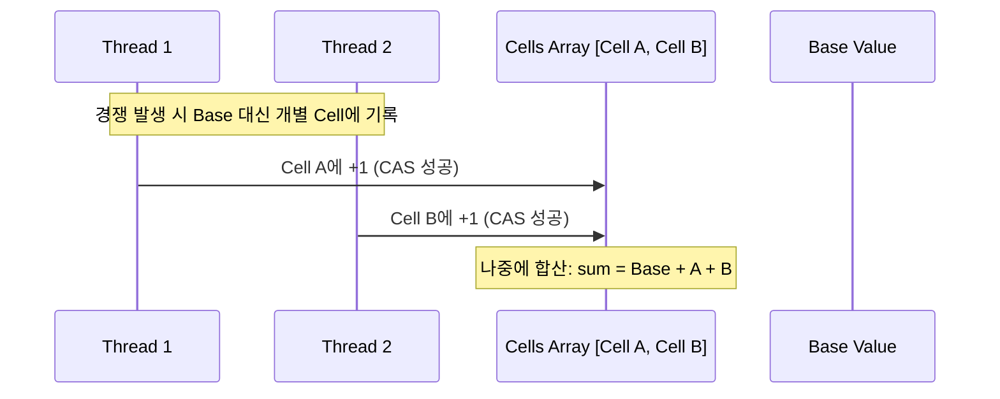

# 정리: 동시성 해결을 위한 락(Lock) 메커니즘 총망라 지도 (V2)

## 1. 계층별 분류 (확장판)

### 🟢 Layer 1: Hardware & OS
| 종류 | 핵심 포인트 |
| :--- | :--- |
| **CAS / SpinLock** | CPU 수준의 무중단/루프 기반 락 |
| **Mutex / Semaphore** | 커널 수준의 Sleep/Wakeup 기반 락 |
| **Ticket Lock** | SpinLock의 불공정성(Starvation)을 해결하기 위해 번호표를 도입한 방식 |

### 🟡 Layer 2: JVM & Java Language
| 종류 | 등장 배경 및 특징 |
| :--- | :--- |
| **Biased Locking** | 한 스레드가 락을 독점할 때 CAS조차 생략하도록 최적화 (Java 15부터 Deprecated) |
| **Lightweight Locking** | 스택 프레임에 락 정보를 기록하여 컨텍스트 스위칭 없이 처리 |
| **Heavyweight Locking** | 경쟁이 심해질 때 OS Mutex를 사용하여 스레드를 블로킹 |
| **LongAdder (Striping)** | 단일 변수 CAS의 병목을 피하기 위해 내부적으로 여러 셀로 쪼개서 관리 (High Contention 최적화) |
| **Phaser / CyclicBarrier** | 여러 스레드가 특정 지점(Barrier)에서 모여야 다음으로 진행하는 동기화 |

### 🔵 Layer 3: Database Engine (PostgreSQL Focus)
PostgreSQL은 매우 세밀한 8단계 락 모드를 제공합니다.

| 종류 | 설명 |
| :--- | :--- |
| **8-Level Table Locks** | `Access Share`(SELECT)부터 `Access Exclusive`(ALTER TABLE)까지 상충 관계를 가짐 |
| **Advisory Locks** | 애플리케이션 레벨에서 특정 비즈니스 로직(예: 중복 결제 방지)을 위해 수동으로 거는 락 |
| **LWLock (Lightweight)** | Buffer Pool 등 공유 메모리 자원 접근을 위한 내부 엔진용 락 |
| **Predicate Lock** | SSI(Serializable Snapshot Isolation)에서 '읽은 범위'에 대한 쓰기를 감시하는 가상 락 |

### 🔴 Layer 4: MySQL 특화 락
| 종류 | 특징 |
| :--- | :--- |
| **Record Lock** | 인덱스 레코드 자체에 거는 락 |
| **Gap Lock** | 레코드 사이의 빈 공간에 거는 락 (Phantom Read 방지) |
| **Next-Key Lock** | Record + Gap Lock의 조합 |

### 🟣 Layer 5: Distributed System
| 종류 | 도구 |
| :--- | :--- |
| **Redisson (Redis)** | Pub/Sub 기반, Watchdog(임계시간 연장) 기능 포함 |
| **Curator (Zookeeper)** | ZNode의 생명주기를 이용한 가장 강력한 일관성 보장 분산 락 |
| **Named Lock (MySQL)** | `GET_LOCK()` 함수를 이용한 세션 기반 분산 락 |

---

## 2. 심화 메커니즘 시각화

### 2.1 JVM 락 인플레이션 (Lock Inflation)


### 2.2 Java LongAdder의 원리 (Striping)


### 2.3 PostgreSQL Advisory Lock (실무 활용)
```sql
-- 비즈니스 로직: 유저별 단일 작업 보장
SELECT pg_try_advisory_lock(user_id); 
-- 성공 시 로직 수행
-- 종료 시 반드시 해제
SELECT pg_advisory_unlock(user_id);
```

---

## 3. 실무 상황별 락 선택 Matrix (Heuristic)

| 상황 | 추천 락 | 이유 |
| :--- | :--- | :--- |
| **카운터 증가 (고밀도)** | `LongAdder` | `AtomicLong`의 CAS 병목 현상 방지 |
| **재고 차감 (단일 DB)** | `Pessimistic Lock` | 정확한 정합성이 우선이며, 트래픽이 감당 가능한 수준일 때 |
| **선착순 이벤트 (분산)** | `Redisson Lock` | Redis의 빠른 속도와 Pub/Sub을 통한 서버 부하 감소 |
| **배치 작업 중복 실행 방지** | `Advisory Lock` | 별도의 Redis 없이 DB 세션만으로 안전하게 처리 가능 |

---

## 4. 새롭게 추가된 탐구 과제
- [ ] **PostgreSQL 락 행렬 분석**: 어떤 락과 어떤 락이 충돌하는가? (매트릭스 정리)
- [ ] **Biased Locking은 왜 제거되었나?**: 현대의 멀티코어 환경에서 오히려 독이 된 이유.
- [ ] **Lock Striping 기법**: ConcurrentHashMap과 LongAdder는 어떻게 자원을 쪼개는가?
